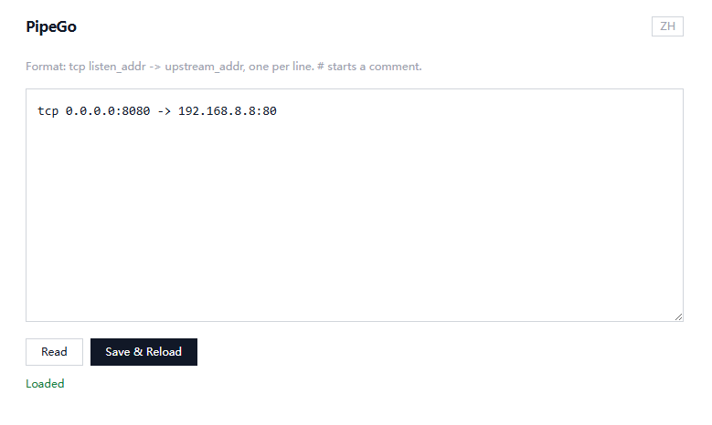

# PipeGo

PipeGo is a lightweight edge gateway and load balancer built with Go.


# pipego.routes

Example:

```text
tcp 0.0.0.0:80 -> 192.168.8.8:80
tcp 0.0.0.0:443 -> 192.168.8.8:443
```

# Build

```bash
go build -o pipego ./
```

# Run

> **-p:** Web management port

> **-a:** Web management password, default account is admin

```bash
sudo ./pipego -p 12138 -a 123456
```

# UI


